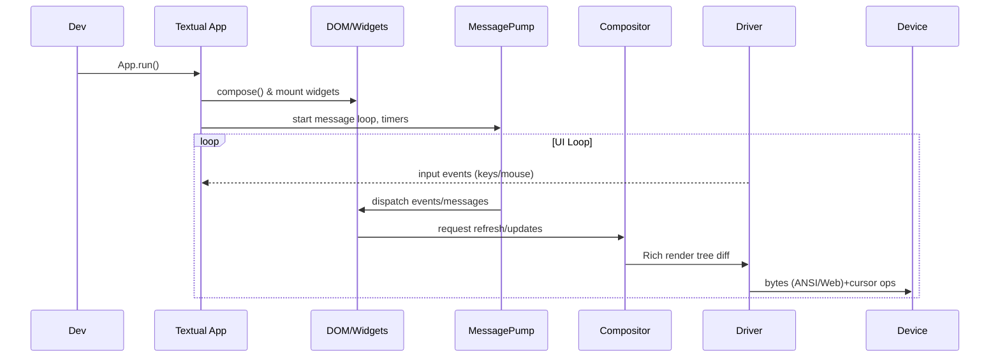
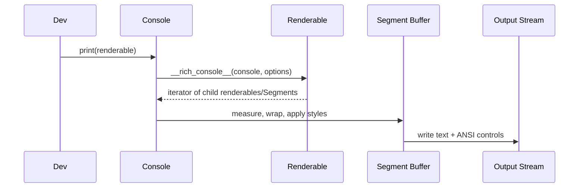
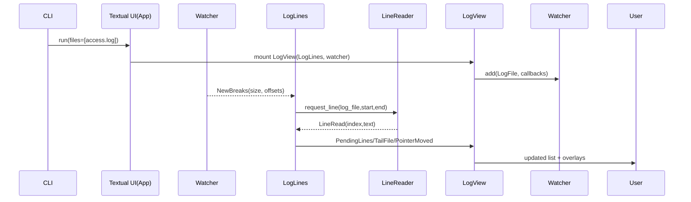
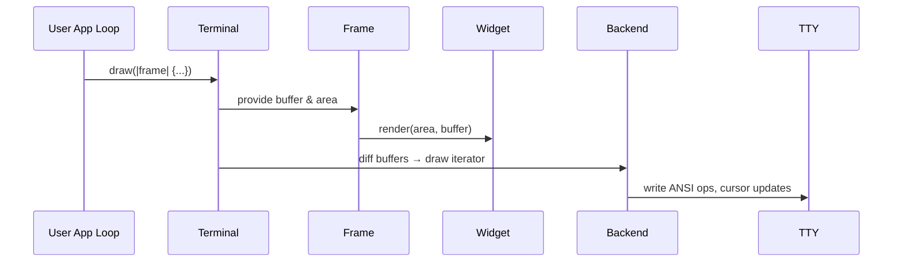
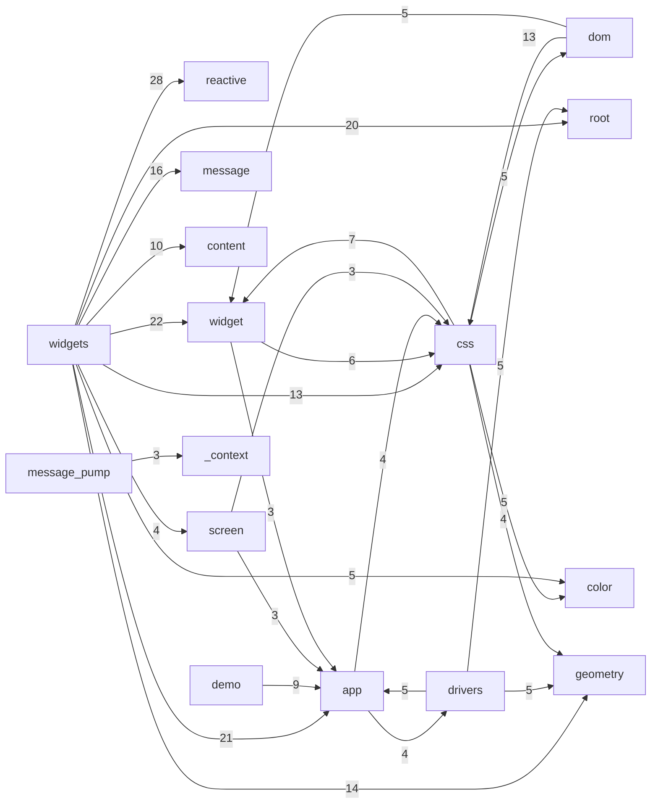

# Architecture Study: Textual, Rich, Toolong, Ratatui

## Textual (Python, Textualize)

### Snapshot
- Purpose: async-first TUI framework that renders widgets in terminals or browsers from a single codebase (`src/textual/app.py`).
- Entry point: subclass `App` to define `compose()` (DOM tree) and CSS (`App.CSS` or external files) which drive layout, behaviors, and themes.
- Hard dependency on Rich for final rendering plus asyncio for concurrency.

### Internal Component Map
- **DOM & Widgets**: `DOMNode` (`src/textual/dom.py`) is the base for `App`, `Screen`, and `Widget`. Widgets describe structure via `compose()` generators and selectors.
- **Message Pump**: `MessagePump` (`src/textual/message_pump.py`) provides async queues, timers, and decorator-driven handlers. Every widget inherits it, so events bubble through the DOM with prevention hooks.
- **CSS / Layout**: `textual/css` parses Textual CSS (TCSS), applies specificity, and injects computed `Styles` into `RenderStyles`. Breakpoints, pseudo-classes, and component classes allow responsive design.
- **Drivers**: `Driver` base (`src/textual/driver.py`) abstracts terminal/web backends. Built-in drivers (terminal, headless, web) translate Rich `Console` output into device-specific writes and feed input events back.
- **Compositor**: `_compositor.py` walks the DOM, materializes render trees, and diff-renders via Rich segments.
- **Async Workers**: `worker_manager.py` plus `@work` decorator allow background threads/coroutines with lifecycle tied to widgets.
- **System services**: notifications, command palette (`textual/command.py`), key bindings, query selectors, `Pilot` for automation/testing.

```
Textual App
├─ Compose() builds DOM hierarchy of Widgets/Screens
├─ MessagePump dispatches Events & custom Messages
├─ CSS engine resolves selectors → Styles
├─ Compositor renders DOM → Rich renderables
└─ Driver streams renderables to terminal/web & feeds input
```

### Sequence (happy path)


### APIs & Extension Points
- Subclass `App` / `Screen` / `Widget`; override `compose`, `on_mount`, `action_*`, `watch_*` reactive handlers.
- CSS selectors + `data_bind` to wire widget state.
- `Message` subclasses + `@on` decorator for typed channels.
- `worker()` background tasks and `Pilot` automation for testing.

### Innovations & Tradeoffs
- **Innovations**: DOM-like tree, TCSS with pseudo-classes, data binding, async-friendly architecture, responsive breakpoints, lazy mounting (`textual.lazy.Lazy`) for performance.
- **Tradeoffs**: Higher learning curve (CSS + message pump), heavier runtime (async event loop, Rich dependency), Python-level performance vs compiled TUI, animations limited by terminal refresh cadence, reliance on Rich’s rendering pipeline.
- **Implications for Ratatat**: replicate ergonomic Compose/CSS/declarative API while delegating low-level rendering to Rust core (ratatui). Need Ruby equivalents for message pump and CSS selection, perhaps binding to `ratatui` via FFI.

---

## Rich (Python rendering toolkit)

### Snapshot
- Purpose: turn Python objects into richly styled console output (`rich/console.py`).
- Central abstraction: `Console` orchestrates renderable protocol, measurement, word-wrapping, color management, and output sinks.
- Provides batteries-included widgets (tables, markdown, progress, layout) and protocols consumed by Textual.

### Internal Component Map
- **Console pipeline** (`rich/console.py`): collects renderables, applies `ConsoleOptions` (size, justification, color system), drives `__rich_console__` generators.
- **Renderable Protocol**: objects implement `__rich_console__(Console, Options)` and optional `__rich_measure__` to describe width constraints.
- **Segments** (`rich/segment.py`): atomic styled text/control codes; pipeline produces `List[Segment]` which is diffed/buffered before writing.
- **Measurement** (`rich/measure.py`): computes min/max widths via renderable measurement hooks.
- **Styles** (`rich/style.py`), Colors (`rich/color.py`), Text (`rich/text.py`), Panels, Layout, Table etc composed out of renderables.
- **Live/Progress**: high-level controllers that repeatedly render layouts, handling double buffering and cursor management.
- **Backends**: `Console` writes to file-like objects; optional Jupyter/export (SVG/HTML) via `_export_format`.

```
Console.print()
 → normalize renderables
 → render loop (call __rich_console__)
 → measure + justify + wrap (cells, combining chars)
 → assemble Segments (text + Style + control)
 → emit to file / record Screen
```

### Sequence (happy path for `console.print`)


### APIs & Extension Points
- Implement renderables via `__rich_console__`, `__rich_measure__`, `rich.protocol.rich_cast`.
- Styles from theme stacks, markup parser (`rich/markup.py`), syntax highlighting (`rich/syntax.py`).
- Live rendering controllers (`rich/live.Live`, `rich.progress.Progress`).

### Innovations & Tradeoffs
- **Innovations**: declarative renderable protocol, measurement aware wrapping, high-fidelity color & emoji handling, export to HTML/SVG, progress/live orchestration.
- **Tradeoffs**: Python speed limits, heavy module graph, stateful global console, bridging to non-ANSI environments needs adapters.
- **Implications for Ratatat**: replicate the renderable protocol in Ruby but lean on Ratatui buffers for actual painting; adopt Rich’s `Segment`/`Style` mental model for compatibility with Textual ergonomics.

---

## Toolong (Textual sample app)

### Snapshot
- Purpose: production-grade log viewer built on Textual + Rich, showing how to assemble an app with lazy loading, background threads, and custom styling (`src/toolong/ui.py`).
- Entry CLI (`src/toolong/cli.py`) uses `click` to parse files/pipes, spawns Textual `UI` app.

### Architecture Highlights
- **UI Layer** (`ui.py`): `UI(App)` wires top-level screen, tabbed panes, merges multi-file tabs, sets ANSI theme and watchers.
- **Screens & Widgets**: `LogScreen` builds `TabbedContent` with `LogView` widgets mounted lazily.
- **LogView Composition** (`log_view.py`): orchestrates `LogLines` (scrollable view), `LinePanel` (detail pane), `FindDialog`, `InfoOverlay`, `LogFooter`. Uses `data_bind` for state propagation and `@on` for message handlers.
- **File Pipeline**:
  - `LogFile` (`log_file.py`) abstracts reading (supports compressed files, memory-mapping, timestamp scanning, format detection).
  - `WatcherBase` + `PollWatcher`/`SelectorWatcher` monitor file descriptors, push newline offsets via callbacks.
  - `LogLines` thread (`LineReader`) requests lines lazily, caches text/timestamps, reacts to watchers via custom `Message` types (`messages.py`).
  - Format detection via `FormatParser`/`LogHighlighter` distinguishes CLF/JSON and applies Rich `Text` spans.
- **Background Workflows**: `@work(thread=True)` watchers handle scanning/merging, `Worker` API wires to UI for async notifications.
- **User Interaction**: pointer navigation, search, tail mode, merging, footers for metadata; heavy use of `Binding`s and `Suggester` for typeahead.

### Sequence (open single file)


### Tradeoffs & Lessons
- Demonstrates how to mix blocking I/O via workers while keeping UI responsive.
- Provides pattern for multi-file coordination (merge metadata, pointer navigation) and overlays with `data_bind`.
- Watcher choice (selector vs poll) shows platform forks; hooking watchers to Textual `Message` pipeline is essential.
- Implication for Ratatat: we can mirror this architecture in Ruby—thin UI layer on top of declarative Compose DSL, watchers written in Rust (via ratatui) or Ruby FFI, message types bridging streaming data to widgets.

---

## Ratatui (Rust TUI core)

### Snapshot
- Purpose: zero-cost Rust crate family for terminal UI, reorganized into workspace crates (`ARCHITECTURE.md`).
- Language/runtime: Rust + `crossterm`/`termion`/`termwiz` backends; immediate-mode rendering into double buffers.

### Workspace Structure
- `ratatui` crate: façade re-export with optional experimental APIs.
- `ratatui-core`: foundational types (`Terminal`, `Frame`, `Buffer`, styles, layout, text, widget traits).
- `ratatui-widgets`: bundled widgets built on `Widget` / `StatefulWidget` traits.
- Backend crates: `ratatui-crossterm`, `ratatui-termion`, `ratatui-termwiz` implement `Backend` trait (cursor control, draw, sizing).
- `ratatui-macros`: helper macros for widget DSLs.

### Core Runtime Flow
- **Terminal** (`ratatui-core/src/terminal/terminal.rs`): owns backend, two buffers, viewport, cursor state. `Terminal::draw` accepts closure with mutable `Frame` and swaps buffers, diffing cells before flushing.
- **Frame** (`ratatui-core/src/terminal/frame.rs`): exposes current area, renders widgets via `render_widget`/`render_stateful_widget`, sets cursor.
- **Backend** trait (`ratatui-core/src/backend.rs`): `draw` receives iterator of changed cells; handles raw mode, alternate screen, mouse capture per backend.
- **Widgets/Text/Layout**: `Widget` trait (`ratatui-core/src/widgets/widget.rs`) describes `render(area, &mut Buffer)`. Layout primitives split `Rect`s, Styles color cells, Text module handles spans/lines.
- **App Loop**: typically user code drives event loop (e.g., `crossterm` input + ratatui draw). Helpers `ratatui::init()/run()` manage setup/teardown, panic hooks.

### Sequence (happy path draw)


### Innovations & Tradeoffs
- **Innovations**: Buffer diffing for minimal writes, backend-agnostic design, workspace split improves compilation + API stability, `WidgetRef` enabling borrowed widgets, panic-safe `run/init/restore` helpers.
- **Tradeoffs**: Immediate-mode means app retains all state; layout is manual vs declarative CSS; advanced effects (animations, async) require user code; bridging to dynamic languages needs FFI.
- **Implications for Ratatat**: use ratatui-core as rendering/terminal backend via Ruby FFI, build higher-level declarative layer replicating Textual ergonomics, possibly embed Rust workers for performance-critical tasks (log tailing, virtualization).

---

## Cross-Library Observations (for Ratatat)
- **Ergonomics gap**: Textual/Rich offer declarative Compose + CSS + data binding; Ratatui offers low-level primitives. Ratatat can wrap Ratatui to mimic Textual APIs.
- **Rendering pipeline**: Rich segments ↔ Ratatui buffers both express styled cells. Mapping Ruby-side DOM to Ratatui buffers requires consistent style abstractions.
- **Concurrency**: Textual leans on asyncio/workers; Toolong shows mixing threads + async. Ruby equivalents (Fibers/Ractors, `async`/`async-io`, `polyphony`, etc.) must coordinate with Rust event sources.
- **Streaming logs**: Toolong’s watcher/message architecture is a template for log-heavy apps we expect Ratatat users to build; watchers could be Rust services emitting events to Ruby DSL.
- **Backends**: Ratatui already supports multiple terminal libraries. If Ratatat wraps it, we inherit portable cursor/mouse handling "for free" while focusing on developer experience.

## Screen Diffing Strategies

### Textual / Rich compositor
- `_compositor` decides between a full redraw and a targeted update by checking `_dirty_regions` before calling either `render_full_update` or `render_partial_update`, so widgets can repaint only their affected geometry (`src/textual/_compositor.py:1084`).
- Partial updates build a bounding crop of dirty regions, convert them into spans per row, then invoke `_render_chops` to slice rendered strips at precomputed column "cuts"; the resulting `ChopsUpdate` contains just the changed fragments (`src/textual/_compositor.py:1153`, `1160`, `1163`, `1170`).
- `_render_chops` walks visible widgets back-to-front, filling per-line dictionaries keyed by column cuts so that the first widget to paint a segment "wins", which avoids overdraw and keeps layering consistent while minimizing redraw width (`src/textual/_compositor.py:1205`, `1210`, `1218`, `1222`).
- Widgets report fine-grained dirtiness via `_exchange_repaint_regions`, and the compositor translates those widget-relative rectangles into screen regions before merging them into `_dirty_regions`, allowing stateful components to request partial reflows (`src/textual/_compositor.py:1236`, `1249`, `1254`, `1257`).

### Ratatui double-buffer diffing
- Each draw pass renders a complete frame into the "current" buffer while the previous buffer is retained; `Terminal::flush` simply diffs the two and streams the minimal set of cell updates to the backend, which also tracks the cursor position (`ratatui-core/src/terminal/terminal.rs:240`, `265`).
- `Buffer::diff` iterates cell-by-cell, skipping segments flagged as `skip`, and emits coordinates whenever glyph, style, or invalidation flags differ; it also handles multi-width graphemes by skipping trailing cells and optionally forcing explicit clears for emoji VS16 cases to avoid artifacts (`ratatui-core/src/buffer/buffer.rs:456`, `484`).
- Because widgets are expected to redraw their entire area every frame, Ratatui’s diffing is agnostic to higher-level widget structure—anything not re-rendered simply persists from the previous buffer, so application code must ensure deterministic full-frame output before letting the terminal diff take over.

### Ratatat takeaways
- If we mimic Textual’s ergonomics, we likely need a dirty-region tracker on the Ruby side so that widget mutations don’t force us to re-run expensive render trees every tick; that tracker can still emit full regions into the Ratatui buffer when necessary.
- Conversely, Ratatui’s cell diffing is battle-tested and already knows how to minimize ANSI writes (multi-width glyphs, cursor management, viewport resizing), so Ratatat can treat Ratatui as the last-mile transport: aggregate dirty widget regions → rasterize them into a staging buffer → let Ratatui flush to the terminal.
- For simple wrappers we could lean entirely on Ratatui’s `Terminal::draw`, but feature parity with Textual (e.g., overlays, layered widgets, partial animations) will benefit from the compositor-style cuts/strips approach feeding Ratatui just the rasterized regions that actually changed.

## Textual Module Dependency Map

To support bottom-up exploration, I parsed every module under `textual/src/textual` with a tiny AST walker that records `import` and `from ... import ...` edges constrained to the `textual.*` namespace. Imports are aggregated to the first path segment (e.g., `textual.widgets.data_table` maps to `widgets`) so the graph remains legible. The current codebase yields **127 module groups**; the script and raw counts are in the repo command history (see the `python` invocations above) so we can regenerate whenever upstream changes land.

### Hubs by outgoing dependencies

| module group | distinct textual targets | Takeaway |
| --- | --- | --- |
| `widgets` | 52 | Widgets lean on almost every subsystem (reactivity, layout, messaging), so reviewing them bottom-up demands plenty of prep. |
| `app` | 49 | Application orchestration pulls in drivers, CSS, DOM, and messaging—touching it impacts most of the stack. |
| `widget` | 37 | Base widget machinery (MessagePump mixins, DOM glue) underpins specialized widgets. |
| `screen` | 27 | Screens bridge apps, DOM, and layout; studying them clarifies how Textual swaps UI states. |
| `css` | 20 | TCSS parsing/rendering depends on geometry, layout, and style helpers. |

### Hubs by incoming dependencies

| module group | distinct textual sources | Why it matters |
| --- | --- | --- |
| `geometry` | 28 | Rect/offset math is universally reused—great starting point for a bottom-up pass. |
| `root` | 25 | The package root re-exports helpers many modules rely on. |
| `widget` | 23 | Many modules depend on the base widget definitions. |
| `app`, `css` | 22 each | Both sit in the middle of most flows; understanding them unlocks many behaviors. |
| `_context` | 20 | Context vars (active app, screen stacks) quietly wire together message pumps and screens. |

### Core dependency diagram

The Mermaid graph below keeps only the high-degree nodes (union of the top outgoing/incoming groups) and labels edges with the number of source files importing that dependency:



Each edge highlights the heaviest intra-package relationships—for example, `widgets → reactive` (28 import sites) signals that Reactive state is a prerequisite before diving into widget internals, while `_context` sits at the intersection of the message pump and screen lifecycle.

### Using the map

1. **Start with utilities**: `geometry`, `color`, `_types`, and `_context` are small but widely used, so understanding them pays dividends.
2. **Move into infra layers**: once utilities are clear, study `message`, `message_pump`, `dom`, and `widget` because everything higher-level builds on them.
3. **Finish with surface areas**: tackle `css`, `app`, `screen`, and finally `widgets`, using the dependency table to know which helpers to inspect next when you encounter unfamiliar imports.

Because the analyzer groups by the first path segment, we can easily rerun it with deeper granularity (e.g., just `widgets.data_table`) when we need to zoom in. This provides a repeatable way to perform bottom-up research passes before translating Textual concepts into Ratatat’s Ruby-facing design.

## Ratatui Module Dependency Map

I ran the same import analysis across the Rust workspace in `../ratatui`, scanning every `.rs` file for `use crate::…` / `use ratatui_*::…` statements. Each file is grouped by the first path segment after `src/` (for example, `ratatui-core/src/widgets/widget.rs` → `widgets`), and each `use` contributes an edge to the first identifier after the crate namespace (`use crate::layout::Rect` → `layout`). This yields **71 module groups** across the workspace.

### Hubs by outgoing dependencies

| module group | distinct targets | Interpretation |
| --- | --- | --- |
| `lib` | 35 | The top-level `ratatui` crate re-exports almost everything, so it fans out across the stack. |
| `widgets` | 23 | Widget implementations lean on layout, buffer, style, text, etc. |
| `main` | 18 | Example binaries/demos exercise many modules—handy exemplars when tracing usage patterns. |
| `init` | 14 | Initialization helpers span backends, terminals, and runtime ergonomics. |
| `ratatui-widgets` | 13 | The dedicated widgets crate bridges into layout/style primitives frequently. |

### Hubs by incoming dependencies

| module group | distinct sources | Why it matters |
| --- | --- | --- |
| `layout` | 34 | `Rect`, `Constraint`, and layout splits underpin nearly every widget. |
| `buffer` | 32 | Double-buffer diffing plus cell math are reused everywhere. |
| `widgets` | 31 | Numerous modules pull in shared widget traits/helpers. |
| `style` | 30 | Styling APIs are ubiquitous—worth understanding early. |
| `text` | 29 | Spans/Lines are core to rendering; mastering them unlocks most widget code. |

### Core dependency diagram

Focusing on the highest-degree nodes (union of the top outgoing/incoming groups) produces the following Mermaid graph—edge labels show how many files import that dependency:

```mermaid
graph LR
    text -- 52 --> style
    main -- 29 --> layout
    main -- 29 --> style
    main -- 28 --> widgets
    main -- 24 --> text
    main -- 23 --> run
    barchart -- 23 --> widgets
    block -- 22 --> widgets
    widgets -- 18 --> layout
    ratatui-widgets -- 17 --> layout
    barchart -- 17 --> style
    ratatui-widgets -- 16 --> style
    ratatui-widgets -- 16 --> widgets
    chart -- 16 --> widgets
    ratatui-widgets -- 15 --> run
    canvas -- 15 --> symbols
    lib -- 14 --> backend
    ratatui-widgets -- 14 --> text
    widgets -- 13 --> buffer
    widgets -- 12 --> text
    main -- 12 --> buffer
    canvas -- 12 --> style
    canvas -- 12 --> widgets
    text -- 11 --> layout
    buffer -- 11 --> layout
    ratatui-widgets -- 11 --> Frame
```

This makes a few relationships obvious: demo `main` targets touch nearly every public surface; `ratatui-widgets` bridges from widgets into low-level primitives (`layout`, `style`, `text`, `Frame`); and specialized widgets (e.g., `barchart`, `block`, `canvas`) still lean on shared building blocks.

### Using the map

1. **Start with data primitives**: read `layout`, `buffer`, `style`, `text`, and `symbols` before diving elsewhere—they are the most reused modules.
2. **Understand rendering glue**: study `backend`, `Terminal`, `Frame`, `init`, and `run` helpers to see how buffers flush to the terminal and how setup/teardown is automated.
3. **Dive into widgets**: once primitives are clear, inspect `widgets` plus concrete implementations (`block`, `barchart`, `canvas`, `chart`, `gauge`, etc.) to see how they compose the primitives.
4. **Use demos/lib entry points**: the `main` and `lib` groups illustrate real-world API consumption—follow their imports when you need usage references.

Like the Textual analyzer, we can rerun the script with deeper segmentation (e.g., targeting just `widgets/list`) when we need to drill into a specific subsystem.
