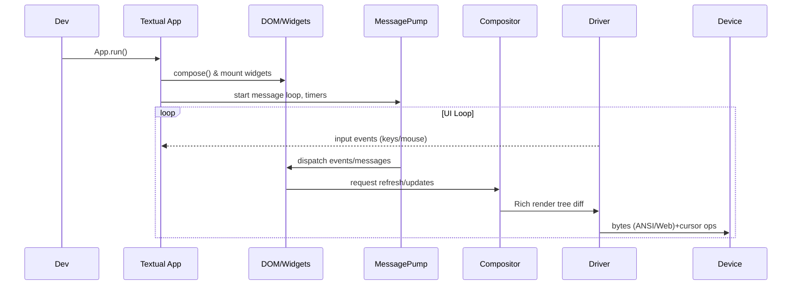
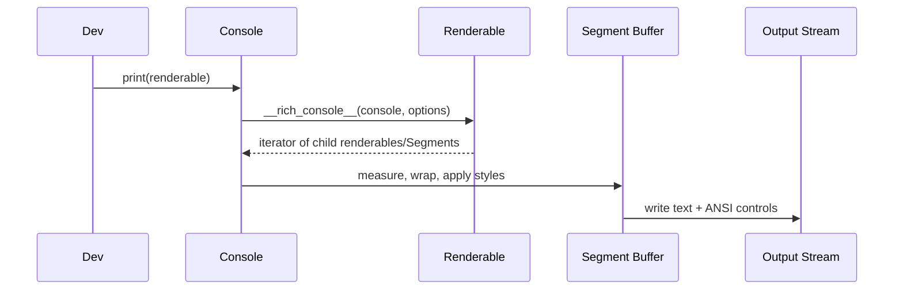
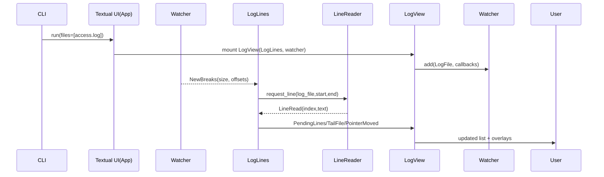
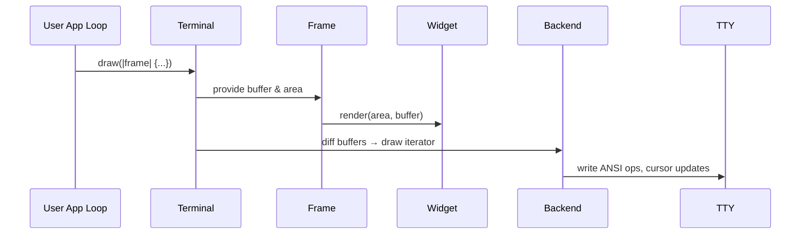

# Architecture Study: Textual, Rich, Toolong, Ratatui

## Textual (Python, Textualize)

### Snapshot
- Purpose: async-first TUI framework that renders widgets in terminals or browsers from a single codebase (`src/textual/app.py`).
- Entry point: subclass `App` to define `compose()` (DOM tree) and CSS (`App.CSS` or external files) which drive layout, behaviors, and themes.
- Hard dependency on Rich for final rendering plus asyncio for concurrency.

### Internal Component Map
- **DOM & Widgets**: `DOMNode` (`src/textual/dom.py`) is the base for `App`, `Screen`, and `Widget`. Widgets describe structure via `compose()` generators and selectors.
- **Message Pump**: `MessagePump` (`src/textual/message_pump.py`) provides async queues, timers, and decorator-driven handlers. Every widget inherits it, so events bubble through the DOM with prevention hooks.
- **CSS / Layout**: `textual/css` parses Textual CSS (TCSS), applies specificity, and injects computed `Styles` into `RenderStyles`. Breakpoints, pseudo-classes, and component classes allow responsive design.
- **Drivers**: `Driver` base (`src/textual/driver.py`) abstracts terminal/web backends. Built-in drivers (terminal, headless, web) translate Rich `Console` output into device-specific writes and feed input events back.
- **Compositor**: `_compositor.py` walks the DOM, materializes render trees, and diff-renders via Rich segments.
- **Async Workers**: `worker_manager.py` plus `@work` decorator allow background threads/coroutines with lifecycle tied to widgets.
- **System services**: notifications, command palette (`textual/command.py`), key bindings, query selectors, `Pilot` for automation/testing.

```
Textual App
├─ Compose() builds DOM hierarchy of Widgets/Screens
├─ MessagePump dispatches Events & custom Messages
├─ CSS engine resolves selectors → Styles
├─ Compositor renders DOM → Rich renderables
└─ Driver streams renderables to terminal/web & feeds input
```

### Sequence (happy path)


### APIs & Extension Points
- Subclass `App` / `Screen` / `Widget`; override `compose`, `on_mount`, `action_*`, `watch_*` reactive handlers.
- CSS selectors + `data_bind` to wire widget state.
- `Message` subclasses + `@on` decorator for typed channels.
- `worker()` background tasks and `Pilot` automation for testing.

### Innovations & Tradeoffs
- **Innovations**: DOM-like tree, TCSS with pseudo-classes, data binding, async-friendly architecture, responsive breakpoints, lazy mounting (`textual.lazy.Lazy`) for performance.
- **Tradeoffs**: Higher learning curve (CSS + message pump), heavier runtime (async event loop, Rich dependency), Python-level performance vs compiled TUI, animations limited by terminal refresh cadence, reliance on Rich’s rendering pipeline.
- **Implications for Ratatat**: replicate ergonomic Compose/CSS/declarative API while delegating low-level rendering to Rust core (ratatui). Need Ruby equivalents for message pump and CSS selection, perhaps binding to `ratatui` via FFI.

---

## Rich (Python rendering toolkit)

### Snapshot
- Purpose: turn Python objects into richly styled console output (`rich/console.py`).
- Central abstraction: `Console` orchestrates renderable protocol, measurement, word-wrapping, color management, and output sinks.
- Provides batteries-included widgets (tables, markdown, progress, layout) and protocols consumed by Textual.

### Internal Component Map
- **Console pipeline** (`rich/console.py`): collects renderables, applies `ConsoleOptions` (size, justification, color system), drives `__rich_console__` generators.
- **Renderable Protocol**: objects implement `__rich_console__(Console, Options)` and optional `__rich_measure__` to describe width constraints.
- **Segments** (`rich/segment.py`): atomic styled text/control codes; pipeline produces `List[Segment]` which is diffed/buffered before writing.
- **Measurement** (`rich/measure.py`): computes min/max widths via renderable measurement hooks.
- **Styles** (`rich/style.py`), Colors (`rich/color.py`), Text (`rich/text.py`), Panels, Layout, Table etc composed out of renderables.
- **Live/Progress**: high-level controllers that repeatedly render layouts, handling double buffering and cursor management.
- **Backends**: `Console` writes to file-like objects; optional Jupyter/export (SVG/HTML) via `_export_format`.

```
Console.print()
 → normalize renderables
 → render loop (call __rich_console__)
 → measure + justify + wrap (cells, combining chars)
 → assemble Segments (text + Style + control)
 → emit to file / record Screen
```

### Sequence (happy path for `console.print`)


### APIs & Extension Points
- Implement renderables via `__rich_console__`, `__rich_measure__`, `rich.protocol.rich_cast`.
- Styles from theme stacks, markup parser (`rich/markup.py`), syntax highlighting (`rich/syntax.py`).
- Live rendering controllers (`rich/live.Live`, `rich.progress.Progress`).

### Innovations & Tradeoffs
- **Innovations**: declarative renderable protocol, measurement aware wrapping, high-fidelity color & emoji handling, export to HTML/SVG, progress/live orchestration.
- **Tradeoffs**: Python speed limits, heavy module graph, stateful global console, bridging to non-ANSI environments needs adapters.
- **Implications for Ratatat**: replicate the renderable protocol in Ruby but lean on Ratatui buffers for actual painting; adopt Rich’s `Segment`/`Style` mental model for compatibility with Textual ergonomics.

---

## Toolong (Textual sample app)

### Snapshot
- Purpose: production-grade log viewer built on Textual + Rich, showing how to assemble an app with lazy loading, background threads, and custom styling (`src/toolong/ui.py`).
- Entry CLI (`src/toolong/cli.py`) uses `click` to parse files/pipes, spawns Textual `UI` app.

### Architecture Highlights
- **UI Layer** (`ui.py`): `UI(App)` wires top-level screen, tabbed panes, merges multi-file tabs, sets ANSI theme and watchers.
- **Screens & Widgets**: `LogScreen` builds `TabbedContent` with `LogView` widgets mounted lazily.
- **LogView Composition** (`log_view.py`): orchestrates `LogLines` (scrollable view), `LinePanel` (detail pane), `FindDialog`, `InfoOverlay`, `LogFooter`. Uses `data_bind` for state propagation and `@on` for message handlers.
- **File Pipeline**:
  - `LogFile` (`log_file.py`) abstracts reading (supports compressed files, memory-mapping, timestamp scanning, format detection).
  - `WatcherBase` + `PollWatcher`/`SelectorWatcher` monitor file descriptors, push newline offsets via callbacks.
  - `LogLines` thread (`LineReader`) requests lines lazily, caches text/timestamps, reacts to watchers via custom `Message` types (`messages.py`).
  - Format detection via `FormatParser`/`LogHighlighter` distinguishes CLF/JSON and applies Rich `Text` spans.
- **Background Workflows**: `@work(thread=True)` watchers handle scanning/merging, `Worker` API wires to UI for async notifications.
- **User Interaction**: pointer navigation, search, tail mode, merging, footers for metadata; heavy use of `Binding`s and `Suggester` for typeahead.

### Sequence (open single file)


### Tradeoffs & Lessons
- Demonstrates how to mix blocking I/O via workers while keeping UI responsive.
- Provides pattern for multi-file coordination (merge metadata, pointer navigation) and overlays with `data_bind`.
- Watcher choice (selector vs poll) shows platform forks; hooking watchers to Textual `Message` pipeline is essential.
- Implication for Ratatat: we can mirror this architecture in Ruby—thin UI layer on top of declarative Compose DSL, watchers written in Rust (via ratatui) or Ruby FFI, message types bridging streaming data to widgets.

---

## Ratatui (Rust TUI core)

### Snapshot
- Purpose: zero-cost Rust crate family for terminal UI, reorganized into workspace crates (`ARCHITECTURE.md`).
- Language/runtime: Rust + `crossterm`/`termion`/`termwiz` backends; immediate-mode rendering into double buffers.

### Workspace Structure
- `ratatui` crate: façade re-export with optional experimental APIs.
- `ratatui-core`: foundational types (`Terminal`, `Frame`, `Buffer`, styles, layout, text, widget traits).
- `ratatui-widgets`: bundled widgets built on `Widget` / `StatefulWidget` traits.
- Backend crates: `ratatui-crossterm`, `ratatui-termion`, `ratatui-termwiz` implement `Backend` trait (cursor control, draw, sizing).
- `ratatui-macros`: helper macros for widget DSLs.

### Core Runtime Flow
- **Terminal** (`ratatui-core/src/terminal/terminal.rs`): owns backend, two buffers, viewport, cursor state. `Terminal::draw` accepts closure with mutable `Frame` and swaps buffers, diffing cells before flushing.
- **Frame** (`ratatui-core/src/terminal/frame.rs`): exposes current area, renders widgets via `render_widget`/`render_stateful_widget`, sets cursor.
- **Backend** trait (`ratatui-core/src/backend.rs`): `draw` receives iterator of changed cells; handles raw mode, alternate screen, mouse capture per backend.
- **Widgets/Text/Layout**: `Widget` trait (`ratatui-core/src/widgets/widget.rs`) describes `render(area, &mut Buffer)`. Layout primitives split `Rect`s, Styles color cells, Text module handles spans/lines.
- **App Loop**: typically user code drives event loop (e.g., `crossterm` input + ratatui draw). Helpers `ratatui::init()/run()` manage setup/teardown, panic hooks.

### Sequence (happy path draw)


### Innovations & Tradeoffs
- **Innovations**: Buffer diffing for minimal writes, backend-agnostic design, workspace split improves compilation + API stability, `WidgetRef` enabling borrowed widgets, panic-safe `run/init/restore` helpers.
- **Tradeoffs**: Immediate-mode means app retains all state; layout is manual vs declarative CSS; advanced effects (animations, async) require user code; bridging to dynamic languages needs FFI.
- **Implications for Ratatat**: use ratatui-core as rendering/terminal backend via Ruby FFI, build higher-level declarative layer replicating Textual ergonomics, possibly embed Rust workers for performance-critical tasks (log tailing, virtualization).

---

## Cross-Library Observations (for Ratatat)
- **Ergonomics gap**: Textual/Rich offer declarative Compose + CSS + data binding; Ratatui offers low-level primitives. Ratatat can wrap Ratatui to mimic Textual APIs.
- **Rendering pipeline**: Rich segments ↔ Ratatui buffers both express styled cells. Mapping Ruby-side DOM to Ratatui buffers requires consistent style abstractions.
- **Concurrency**: Textual leans on asyncio/workers; Toolong shows mixing threads + async. Ruby equivalents (Fibers/Ractors, `async`/`async-io`, `polyphony`, etc.) must coordinate with Rust event sources.
- **Streaming logs**: Toolong’s watcher/message architecture is a template for log-heavy apps we expect Ratatat users to build; watchers could be Rust services emitting events to Ruby DSL.
- **Backends**: Ratatui already supports multiple terminal libraries. If Ratatat wraps it, we inherit portable cursor/mouse handling "for free" while focusing on developer experience.
